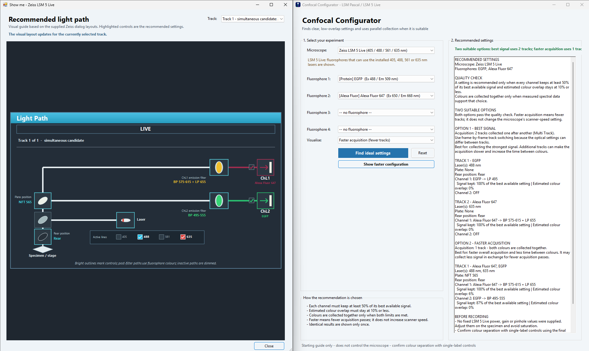

# Confocal Configurator

Confocal Configurator is an offline Windows tool for choosing laser, splitter, emission-filter and acquisition-track settings on two specific ZEISS microscopes: the LSM Pascal and LSM 5 Live. Select up to four fluorophores and it proposes a beam path that fits the documented hardware.

It is a planning aid. It does not connect to or control the microscope.



## Download and run

Download [`Confocal-Configurator.exe`](./Confocal-Configurator.exe?raw=1) and run it. There is no installer and no external library dependency. The executable is built for 32-bit Windows with the .NET Framework 2.0 compiler and also runs under WOW64 on 64-bit Windows Vista.

1. Select the microscope.
2. Select up to four fluorophores.
3. Click **Find ideal settings**.
4. Choose a recommendation and open its light-path guide.

When two useful configurations exist, the program shows both:

- **Best signal** chooses the strongest qualified signal, even when that requires additional acquisition tracks.
- **Faster acquisition** uses the fewest qualified tracks. It does not alter scan speed, dwell time, averaging, image resolution or laser transmission.

If both approaches produce the same hardware settings, only one ideal configuration is shown.

## Supported configurations

| Microscope | Installed excitation lines |
| --- | --- |
| ZEISS LSM Pascal | 458, 488, 543 and 633 nm |
| ZEISS LSM 5 Live | 405, 488, 561 and 635 nm |

The available splitters and filters are based on the documented laboratory configurations. This is not a general configurator for every LSM Pascal or LSM 5 Live installation. Check that the suggested components are present on the microscope before recording.

For the Pascal, the report includes the supplied starting values: 7% transmission at 488 nm, 50% at 458, 543 and 633 nm, detector gain 700 and a 1.5 Airy-unit pinhole. No fixed starting values are included for the LSM 5 Live.

## How recommendations are chosen

A recommended channel must retain at least 50% of that fluorophore's best isolated signal in the model, while estimated same-dye spillover into each other channel must remain at or below 10%. Fluorophores are placed in the same track only when both limits are met and a measured emission curve is available.

These limits are conservative screening rules, not biological acceptance criteria. Similar fluorophores such as GFP, FITC and Alexa Fluor 488 may not be separable with the available hardware. Confirm colour separation with single-label and negative controls using the final acquisition settings.

Emission data for fluorescent proteins come from [FPbase](https://www.fpbase.org/api/) and are provided under [CC BY-SA 4.0](https://creativecommons.org/licenses/by-sa/4.0/). Most chemical-dye profiles come from the [Thermo Fisher Fluorescence SpectraViewer catalog](https://www.thermofisher.com/content/dam/LifeTech/Documents/spectra/spectra.xml). The calculated percentages compare reference spectra and filter passbands; they do not predict measured image intensity. Fluorophore brightness, label abundance, detector response and measured component transmission are outside the model.

## Build and test

On Windows with the .NET Framework 2.0 C# compiler installed:

```bat
build.cmd
test.cmd
```

`build.cmd` creates the x86 executable. `test.cmd` compiles the same source as a temporary library and runs the regression suite.
